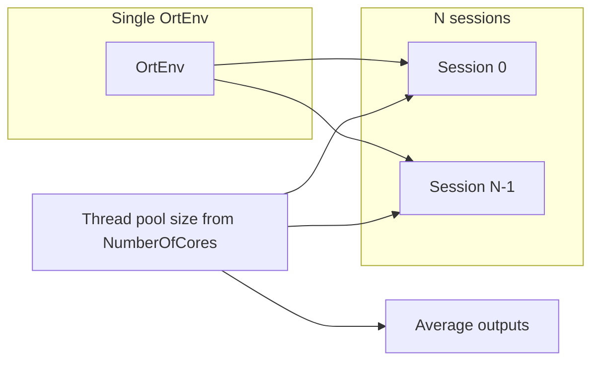

# NuWro ONNX neural network integration plan

## Current state (verified in repo)

- **[`src/NeuralNetworks/NN.h`](src/NeuralNetworks/NN.h)** / **[`NN.cc`](src/NeuralNetworks/NN.cc)**: C API wrapper that creates **one `OrtEnv` per `NeuralNetwork` instance**, loads one session, caches I/O names, sets `SetIntraOpNumThreads` from [`params_all.h`](src/params_all.h) `NumberOfCores`, and selects execution provider from `HardwareSupport` (CPU vs GPU). **No `Run()` / inference API yet.**
- **GPU selection**: CUDA is attempted only under **`#if defined(_WIN32)`**. Apple Silicon uses CoreML. **Linux has no CUDA/TensorRT path** in `configure_execution_provider` (falls through to CPU with a reason string).
- **Build**: [`Makefile`](Makefile) adds `-I${ORT_HOME}/include` and `-lonnxruntime` **only on Darwin** (lines 16–19); the **Linux branch does not add the ONNX include path** (lines 21–24), so Linux builds will fail on `#include <onnxruntime/...>` unless fixed. **`src/NeuralNetworks/*.o` is not listed** in the `$(BIN)/nuwro` recipe (lines 71–76), so the new code is not linked today.
- **Params already exist**: `NeuralNetwork_guided`, `HardwareSupport`, `NumberOfCores`, **`NumberOfNetworks` (default 50)** in [`params_all.h`](src/params_all.h) / [`params.xml`](src/params.xml). They are **not referenced** from physics code yet.
- **Runtime paths**: [`dirs.cc`](src/dirs.cc) sets `data_dir` to `bin/../data/` (or `NUWRO`-based fallback). ONNX files currently live under **`src/NeuralNetworks/EmpericalFits/`**, which is **not** on that data path unless you copy/install them or add a dedicated directory parameter.

## Architecture recommendation

1. **Refactor Ort lifetime for ensembles**  
   Creating **50× `OrtEnv`** (current design: one per `NeuralNetwork`) is unnecessary overhead. Introduce a small **shared runtime object** (e.g. `OrtRuntime` or static factory) that owns **one `OrtEnv`** (and optionally **one `OrtSessionOptions` template** cloned or recreated per session with the same EP/thread settings). Each ensemble member is then **one `OrtSession` + metadata**, not a full `NeuralNetwork` duplicate of env/options unless you prefer minimal change and accept higher memory (not recommended for 50 models).

2. **`EmpericalFits` module** ([`EmpericalFits.h`](src/NeuralNetworks/EmpericalFits.h) / [`EmpericalFits.cc`](src/NeuralNetworks/EmpericalFits.cc) — to be added)  
   - **Load** `par.NumberOfNetworks` (or fewer if files missing) ONNX files from a **configurable root** (see below), for a given nucleus tag (e.g. `C12` vs `Fe56` subdirs).  
   - **Discovery**: glob/sort files matching a stable pattern (e.g. `model_electron_A_12_*.onnx`); **note**: the tree includes **`model_electron_A_12_ver_0.onnx`** in addition to `_0`…`_49` — clarify whether the ensemble is **exactly 50** files or **50 + 1** and filter accordingly.  
   - **Inference**: For each model, build input `OrtValue`(s) for tensor name **`input`**, element type **DOUBLE** (maps to your “float64”), shape taken from the model via `SessionGetInputTypeInfo` / dimensions (do **not** assume `[5]` vs `[1,5]` without checking). Output tensor **`Identity:0`**, DOUBLE, scalar or shape `[1]`.  
   - **Ensemble output**: **Arithmetic mean** of the `N` scalar outputs.  
   - **Parallelism**: Use a **two-level policy** to honor `NumberOfCores` without oversubscribing:
     - **Outer**: parallel over models (thread pool, OpenMP, or `std::async` with a **concurrency cap** = `NumberOfCores` or a dedicated param if you split “inter-model” vs “intra-op” later).
     - **Inner**: either set **`SetIntraOpNumThreads(1)`** on each session when outer parallelism is high, **or** keep current intra-op threads and run models **sequentially** — pick one coherent strategy (recommended: **outer parallel + intra-op 1** for ensemble of small nets on CPU).

3. **Public API shape**  
   Expose a narrow function used by physics code, e.g. `double predict_empirical_fit(const params &p, int A, const double inputs[5]);` or a small struct for inputs, returning the **ensemble mean**. Hide all Ort details inside `NeuralNetworks/`.

4. **Integration point**  
   `NeuralNetwork_guided` should gate calls to the NN path vs existing formulas. The natural hook for **electron SPP** is **[`src/e_spp_event.cc`](src/e_spp_event.cc)** (and variants if you use `e_spp_event2`/`3`), where cross sections are computed today (e.g. `dsigma_dQ2_dW_`). Exact **where** to multiply or replace weight must follow your physics spec — the plan is to **add a branch** when `p.NeuralNetwork_guided` is true, **after** you define which kinematic variables map to the **5 inputs**. If the fit applies elsewhere (MEC stub at `nuwro.cc` dyn 22), document and wire separately.

5. **Model deployment path**  
   Choose one:
   - **Install/copy** ONNX files to e.g. `data/NeuralNetworks/EmpericalFits/C12/` and resolve via `get_data_dir()` + relative path; or  
   - Add a **string param** (e.g. `NeuralNetwork_model_dir`) defaulting under `get_data_dir()` for portability.  
   Avoid hardcoding source-tree paths in release builds.

6. **Build system**  
   - Add **`src/NeuralNetworks/NN.o`** and **`src/NeuralNetworks/EmpericalFits.o`** to the `nuwro` (and any other binary that needs inference) link line.  
   - **Linux**: add `-I${ORT_HOME}/include` to `CXXFLAGS` (mirror Darwin).  
   - Document **`ORT_HOME`** (and optional GPU provider libraries) in README or build notes for each OS.  
   - If you use **C++17** features (`std::filesystem`, `std::optional`), ensure `CXXFLAGS` matches (NuWro currently does not force `-std=c++17` globally in the Makefile snippet reviewed).

7. **Cross-platform EP coverage**  
   - **Windows**: existing CUDA attempt — keep aligned with installed ORT build (CUDA vs DirectML).  
   - **Linux**: add **`OrtSessionOptionsAppendExecutionProvider_CUDA`** (and optionally TensorRT) when `HardwareSupport` is on, with the same fallback pattern as Windows.  
   - **macOS**: keep CoreML path; document that Intel Mac has no CoreML EP in this snippet — CPU fallback is OK.

8. **Testing / validation**  
   - Smoke test: load all models at startup (or lazy-load first use) and run **one forward pass** with known inputs, compare mean to a reference.  
   - Threading: run under **ThreadSanitizer** or heavy load to ensure no data races on shared `OrtEnv` (sessions are generally safe for concurrent `Run` from different threads per ORT guidance; still verify for your ORT version).

## Risk notes

- **Tensor names**: `"Identity:0"` is typical of TF exports but can differ if models are re-exported; consider asserting at load time.  
- **Precision**: Ensure export used **double** throughout; if models are actually float32, switch to `FLOAT` in code to match ONNX files.  
- **Repo size**: 50+ ONNX files may warrant **Git LFS** or distribution outside the main tree.
